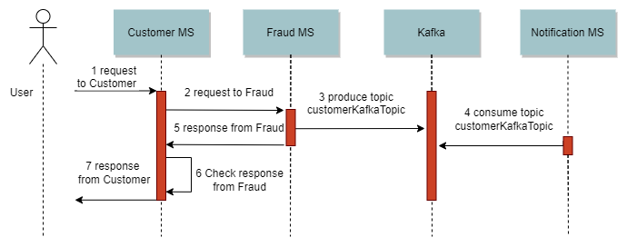

# Microservice V4

This project is an example of microservice using Spring Boot, Docker and Kafka. It was used Swagger Codegen to generate documentation and OpenFeign client.

##### Infrastructure


##### Flow



# Running the application.

### 1. Docker

In the root project folder, run the command:

```shell
<microserviceV4>$ docker compose up
```

Here is how to check the database

- URL: [http://localhost:8080/?server=mariadb](http://localhost:8080/?server=mariadb)
- Server: mariadb
- Username: root
- Password: example
- Database: example


### 2. Run application

1. Run Eureka Server

In the `eureka-server` project folder, run the command:

```shell
<eureka-server>$ mvn spring-boot:run
```

2. Run All Services

In each service folder (`service-customer`, `service-fraud` and `service-notification`) without caring about the order, run the command:

```shell
<each-project-folder>$ mvn spring-boot:run
```

3. Postman

- POST: [http://localhost:8081/customers/](http://localhost:8081/customers/)
- JSON:

```JSON
{
  "firstName": "Ricardo",
  "lastName": "Ribeiro",
  "email": "ricardo@gmail.com"
}
```

### 3. Links

- Database: [http://localhost:8080/?server=mariadb](http://localhost:8080/?server=mariadb)
- Zipkin: [http://localhost:9411/zipkin/](http://localhost:9411/zipkin/)
- Eureka Server: [http://localhost:8761](http://localhost:8761)
- Customer MS Swagger: [http://localhost:8081/customers/swagger](http://localhost:8081/swagger)
- Fraud MS Swagger: [http://localhost:8082/fraud/swagger](http://localhost:8082/swagger)

# Resources

- https://shdhumale.wordpress.com/2021/07/16/creating-spring-boot-feign-client-code-using-swagger-code-generator-using-plugin/
- https://github.com/janitham/swagger-codegen-feign-example
- https://www.polak.ro/2021/04/02/api-first-and-code-generation-done-right.html
- https://medium.com/trendyol-tech/how-to-write-a-spring-boot-library-project-7064e831b63b
- https://spring.io/guides/gs/multi-module/
- https://mydeveloperplanet.com/2022/02/08/generate-server-code-using-openapi-generator/
- https://www.youtube.com/watch?v=t4jaTC7QjMg
- https://resilience4j.readme.io/docs
